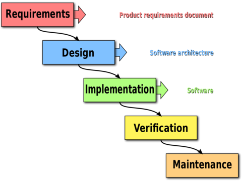

# Introduction
There are a number of differences between working for a small or a large company. For someone looking to enter the workforce, or change employments, it can be difficult to know which companies to target. This document will outline some of the differences between small and large companies in the area of software development.
# Overview
 - Workflow

 One of the largest differences between small and large companies is their workflows. Development cycles vary immensely from company to company, but trends begin to appear among small and large companies alike.
 - Culture

 Company culture is one of the most important factors of workplace happiness. Large companies and small companies often differ greatly in culture. Culture is something that varies between companies just as much as workflows, but generalizations can be drawn between small and large companies.
 - Advancement

 Advancement works differently from company to company, but especially between large and small companies.
 - Downsides

 With any company there are downsides, some downsides can be generalized between large and small companies.

# Small Companies
### Workflows
Startups tend to be more 'agile', meaning that they can pivot tasks quickly, and have quick turnarounds from planning to implementation. In fact, many startups follow what is known as an `agile` development process. This word can mean many things, but often takes the form of `scrums`, `sprints`, and `user stories`. These are devices used to encourage quick development, allowing for companies and teams to work around user needs, with a quick response team. Scrums, or daily standups, are meetings where all employees gather to share their progress, and goals. Sprints are often one to two weeks in length, with a well defined and attainable goal, usually based around a user story, or use case/need. This rapid fire development process can lead to feelings of intense pressure for those who do not work well with deadlines, or consistent validation for those who operate well under the pressure of regular deadlines. 

### Culture
Small companies, especially those who deal with primarily software, tend to be more attuned to the open source community. Their quick turnaround times mean that they can leverage new technologies quicker, and some companies even encourage open source contribution as part of work. Startups have become infamous for their lax cultures, where employees may nap, play games, or work on bean bag chairs. Employees at small companies are often much more invested in their company's project, as its success has a much more direct impact on their lives. The culture at startups are built to encourage employees to spend time at work, and often a `work-as-a-family` mentatility is encouraged. 

### Advancement
Small companies are just that, small. Overall there are less positions at a small company, which means that there are in turn less positions to move into. In addition, raises depend upon the sucess of the company - a company struggling to succeed does not have the capital to invest in their already employed employees. On the other hand, a very successful startup can reward employees with stock
### Downsides
At a small company, one of the largest challenges is providing value to investors. This means that sometimes employees are required to put in long hours for weeks at a time. This is expected behavior and defacto rule at many small companies. Additionally, many small companies do not have the budget to pay high salaries, and employees may be paid less then they are worth.

# Large Companies

### Workflows
Meanwhile, larger companies deal more with more logistics and red tape, ensuring that the planning process is entirely complete before moving on to implementation. Many companies subscribe to a waterfall method of software development, where the life cycle of software takes place in a number of stages. It begins with user requests and developer needs, and moves slowly through planning to implementation to testing. In a waterfall lifecycle, once a project has graduated to the next level, it cannot move upwards. This means that projects are well planned, but long term and unflexible.

### Culture
Large companies are often more diverse, with many different groups of people built around any number of interests. At a large company it is easier to find a group of people with similar hobbies and interests. Large companies often have the capital to sponsor events for these groups, as they directly impact happiness at work.
### Advancement
Large companies are often very structured, with junior developers, senior developers, project management, middle management, and executives. As such, many large companies have very structured paths towards advancement, with laid out raises.
### Downsides
Many employees of large companies work on a singular area of a single project. This has become known as `software development as a commodity.` For some, this is unsatisfying, and provides little variation in work.